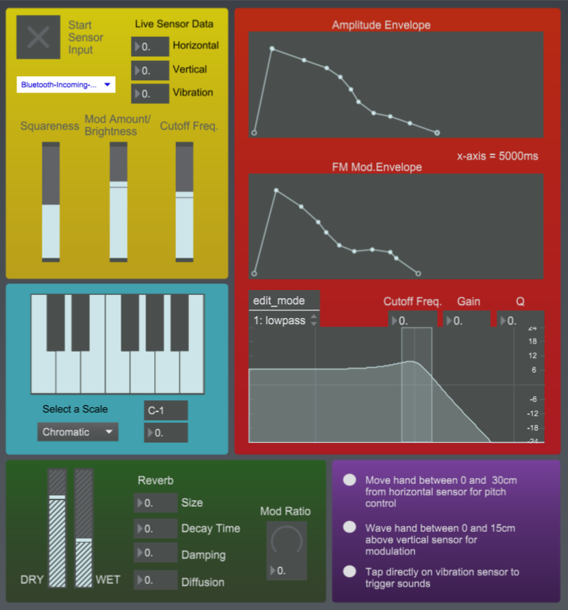
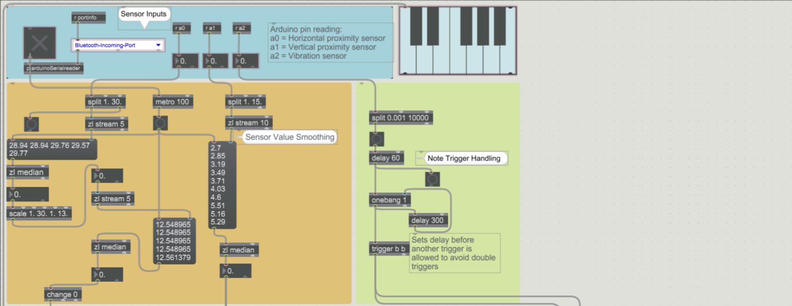

# Gesture-Controlled DMI
\
  The Digital Musical Instrument (DMI) that has been built for this project utilises 2 proximity sensors and a piezo vibration sensor to create an instrument in which all changes in frequency and modulation take place without any physical contact with the instrument itself.
  
Notes are triggered by tapping the piezo vibration sensor and each note's velocity is dependent on the force used by the user. The horizontal proximity sensor takes the place of a traditional row of keys (with the pitch increasing from left to right), while the modulation wheel that is found on most modern controllers is replaced by a vertical proximity sensor. This mapping makes the instrument intuitive to play for any musician, and the way that the instrument responds to subtle movements mimics the aftertouch and vibrato functions on some modern MIDI controllers. The instrument's GUI is shown below:

## Implementation

### Receieving Sensor Values

The SRF-05 proximity sensors that were used work by measuring the time for an ultrasonic sound wave to travel from the sensor to an object and return to the emitter. This calculation is carried out in Arduino code where the sensor’s trigger is set to pin 4 and the echo receiver is set to pin 5. The vibration sensor is simpler to set up, though a resistor is required across the component to maintain a steady base voltage. The Arduino’s code loops around every 20ms to output sensor values 50 times per second as it was found that receiving values at regular intervals made it easier to smooth out values consistently. The `Arduino2Max` patch (created by Daniel Jolliffe, 2007) was then used to transfer the data from the Arduino’s pins to the Max environment.
  

Once Max was receiving sensor data the values needed to be smoothed to be usable in a musical context. The `split` object was used to set a limit on each sensor’s effective range and dispose of any values that lay outside of it. This means that the averaging of input values is not thrown off by outlying figures. Values that are passed are sent into `zl stream` objects that store a list of the last 5 values and the `zl median` objects then average the values in the list every 10th of a second to give a clearer idea of the real distance from each sensor to the user’s hand. In the case of the pitch sensor, the smoothed figures are scaled to a range 1 to 12 (for each playable note) before being averaged again and converted from floats to integer values. 

### Pitch Handling

Once in this state, the value is sent to a series of `select` objects that match the value to a MIDI note whenever it changes. Before the MIDI note numbers are converted to frequencies, the `scale quantise` object from Todd Winkler (1998) is used to quantise notes into a scale of the user’s choosing, meaning that no notes outside of the selected key can be triggered. This can be very valuable if a user is having difficulty playing the correct pitch due to the potential inaccuracy of the proximity sensors. To aid with the controlling of pitch, the user receives visual feedback from the patch display.

### Sound Generation

Sound generation is carried out using FM synthesis with a carrier wave that moves between a pure sine and a square wave, and a sine wave modulator. The amount that the carrier wave morphs toward a square wave is controlled by the modulation sensor so that as the user’s hand moves higher, more harmonics are introduced to the sound. The output of the vertical modulation sensor is also mapped to the frequency modulation amount and the cut-off of a low-pass filter so that the sensor has the perceived effect of controlling the sound’s overall brightness. In testing this mapping, it was found that the most reliable way to rapidly increase the modulation amount is to wave the hand from side to side as it is raised. This need to put constant movement and energy into the instrument makes the experience of playing closer to a traditional instrument where the player may need to constantly strum or bow the instrument to get a musical output. Portamento is also included, using the `rampsmooth~` object to glide between distinct pitches and `slide` objects are used on the modulation parameters to avoid overly sudden changes in timbre.
	`Delay` and `onebang` objects are used on the input values from the vibration sensor to prevent an earlier issue where striking the sensor would result in a number of rapid `bangs` to the envelopes due to the piezo’s temperamental nature. This introduces a 60ms delay from hitting the sensor to the sound being triggered which was found to be a negligible gap while solving the previous issue. The user was initially bound to only attack and decay values for each envelope, but the use of the `function` and `line~` objects together means that more complex envelopes can drawn in graphically. The final part of the patch is Max’s `yafr2~` reverb unit (by Randy Jones) which adds some spaciousness to the sound that compliments the instrument’s reedy tone.    
  

*Additional code used in this project comes from:*

'arduino2max' by Daniel Jolliffe, 2007  <https://www.danieljolliffe.ca/writing+code/writing+code.htm> \
'Scale Quantise' by Todd Winkler, 1998 <https://mitpress.mit.edu/books/composing-interactive-music> \
'yaffr2~' by Randy Jones, Available within Max MSP's built-in library
